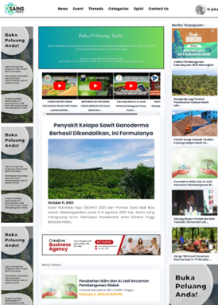
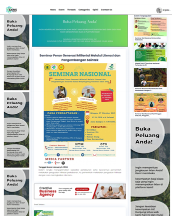
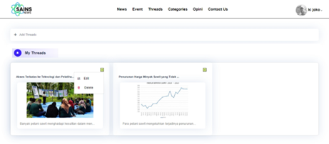
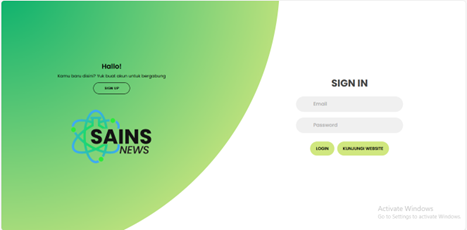

# 📰 Sains News – Web Portal Berita

**Sains News** adalah portal berita berbasis web yang menyajikan berbagai informasi terkini dari berbagai kategori seperti teknologi, kesehatan, lingkungan, bisnis, dan sains. Website ini dirancang dengan fokus pada kemudahan akses, tampilan modern, serta pengalaman pengguna yang baik.

---

## 🚀 Fitur Utama

- 🔐 Autentikasi pengguna (Login & Sign Up)
- 📰 Daftar berita dan detail berita
- 💬 Komentar pada berita
- 🧵 Threads / diskusi
- 🗂️ Kategori berita
- 📅 Event
- 👤 Edit profil pengguna
- 📱 Tampilan responsif

---

## 🛠️ Teknologi yang Digunakan

- HTML5
- CSS3
- JavaScript
- Firebase (Authentication & Hosting)
- Git & GitHub

---

## 📸 Tampilan Aplikasi

### Halaman News


---

### Halaman Categories


---

### Detail News & Komentar


---

### Halaman Event


---

### Threads


---

### Login


---

### Sign Up


---

### Form Edit Profile


   ```bash
   git clone https://github.com/naufalbsyrf/webusersawit.git
